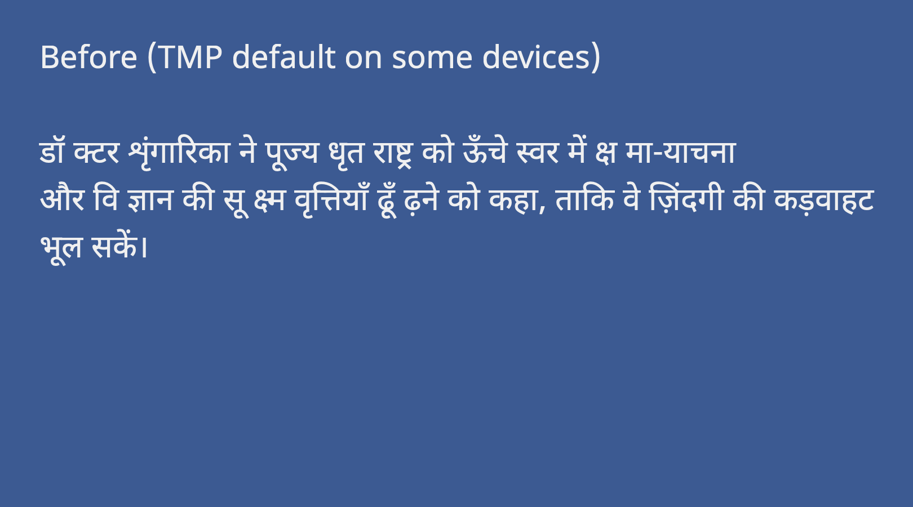
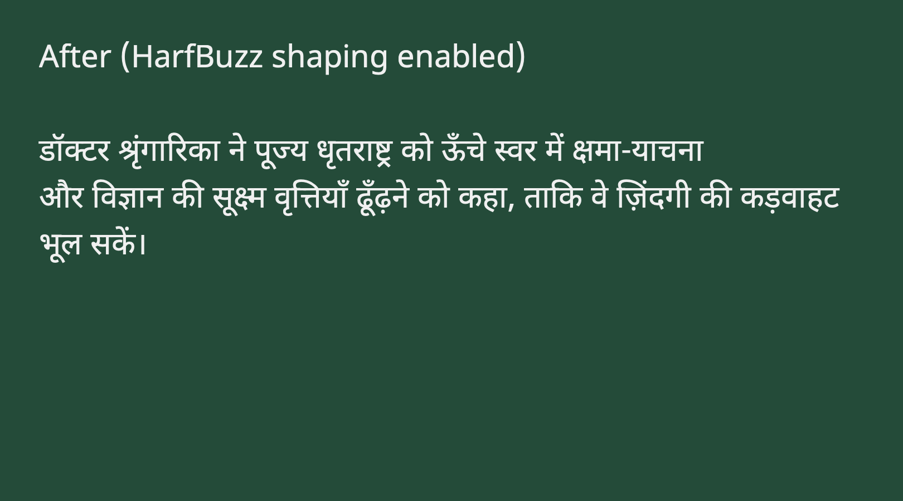
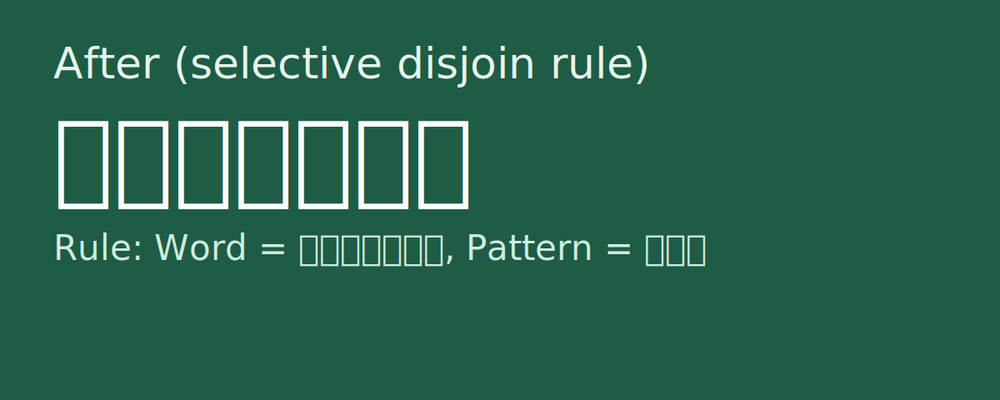

# IndicFlow - TMP Text Shaping Engine

Unity TextMeshPro Hindi/Devanagari shaping fix (HarfBuzz) for Android + iOS + Editor.

If Hindi text looks correct in Editor but breaks on devices (conjuncts, matras, nuqta, chandrabindu), IndicFlow provides HarfBuzz shaping in TMP UGUI through `TMPro.HarfBuzzTextMeshProUGUI`.

## 1-Minute Install

Add this to `Packages/manifest.json`:

```json
{
  "dependencies": {
    "com.unity.ugui": "https://github.com/NikhilCreaxt/indicflow.git?path=/Packages/com.unity.ugui#v2.0.0-hb.25"
  }
}
```

Important:
- This is a replacement fork of `com.unity.ugui`.
- Keep only one `com.unity.ugui` entry.

## Demo + Tool In Same Repo

- Package: `Packages/com.unity.ugui`
- Demo project: `Demo/IndicFlowDemo`
- Demo scene: `Demo/IndicFlowDemo/Assets/Scenes/SampleScene.unity`

## Before / After





## No-Join Word Settings (Feature Preview)

Use No-Join rules when specific Hindi words (or specific conjunct patterns inside a word) should render disjoined.




## Supported

- Editor (macOS/Windows)
- Android (IL2CPP)
- iOS (IL2CPP)
- Unity 6000.2.x and 6000.3.x

## Common Errors

### `CS0136 ... packagePath ...`
- Use `#v2.0.0-hb.25` or newer.
- Close Unity, delete `Library/PackageCache/com.unity.ugui@*`, reopen.

### `HarfBuzz native plugin missing ... HindiHarfBuzz not found`
- Ensure only one active `HindiHarfBuzz` plugin per platform.
- Remove duplicates from `Assets/Plugins` if present.

### `HarfBuzz font file not found`
- The package includes bundled fallback `.ttf.bytes` and bundled fallback TMP font asset in `Runtime/Resources/IndicFlow`.
- These bundled defaults are auto-used by `HarfBuzzTextMeshProUGUI` for zero-setup usage.
- Sample import is not required for basic use.
